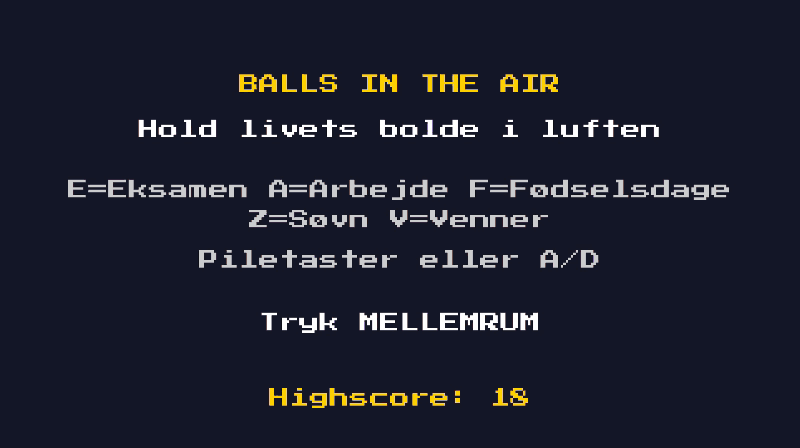

## Balls in the Air

Jeg ville lære C# og spiludvikling ved at bygge et færdigt projekt på 3 dage i stedet for kun at følge en tutorial. Idéen kom fra min egen hverdag med studie, arbejde og alt det andet, der skal holdes i luften.

## Sådan spiller du
- **Venstre/højre** eller **A/D**: bevæg dig
- **Mellemrum**: start / prøv igen
- **Escape**: luk spillet

## Kør spillet
1. Installér .NET 9 SDK
2. Klon repoet og gå ind i mappen
3. `dotnet tool restore`
4. `dotnet run`

Mine arkitektoniskebeslutninger ligger i [docs/adr](docs/adr).

## Hvad jeg har lært
- Delta time gør at spillet kører lige hurtigt på alle computere
- et switch-udtryk er en kort måde at vælge en værdi på ud fra mange muligheder

## Hvad jeg havde svært med
- Huske tegne og hvornår man skulle bruge dem såsom '=' og '==', det skal bare genopfriskes 
- Jeg prøvede at snakke igennem hvad koden gjorde efter jeg testede det også for at få forstålsen i hovedet, det gjorde det også nemmere at huske 

## Credits
- Font: [Press Start 2P](https://fonts.google.com/specimen/Press+Start+2P) af CodeMan38 (SIL Open Font License)